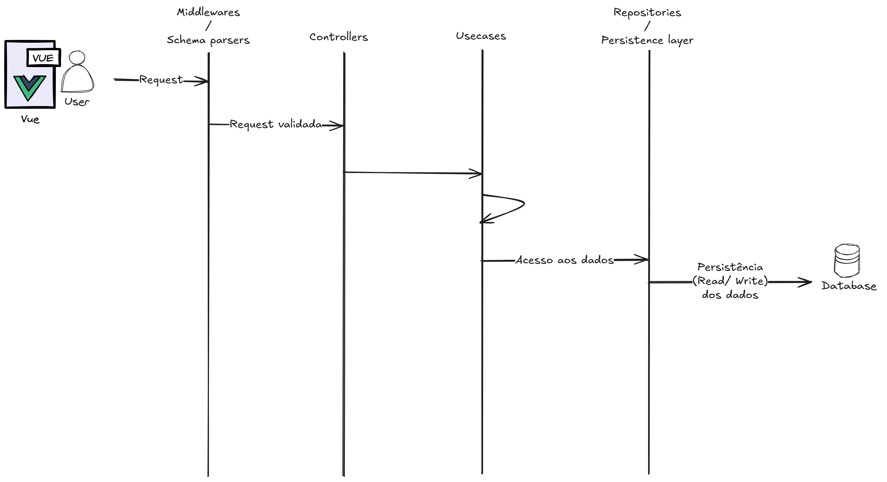

# Comentários
- [Decisão da arquitetura](#decisão-da-arquitetura)
- [Lista de bibliotecas externas](#lista-de-bibliotecas-externas)
- [O que eu melhoraria se tivesse mais tempo](#o-que-eu-melhoraria-se-tivesse-mais-tempo)
- [Quais requisitos obrigatórios não foram atendidos](#quais-requisitos-obrigatórios-não-foram-atendidos)

## Decisão da arquitetura

### Descrição

A arquitetura consiste em uma aplicação SPA (Single Page Application) que consome uma API RESTful. O frontend é desenvolvido com Vue (utilizando Vuetify) e a API, com Node.js e Express. O banco de dados utilizado é o PostgreSQL.

No código, o backend está organizado em diversas camadas: Middlewares, Controllers, Usecases e Repositories, com interfaces que possibilitam a troca de banco de dados, se necessário, e a execução de testes. O frontend é estruturado em rotas e componentes, o que facilita a manutenção e o desenvolvimento. A comunicação entre frontend e backend ocorre por meio de chamadas HTTP, utilizando Axios como cliente.

### Diagrama

### Justificativa

A escolha se baseia em um sólido conhecimento sobre aplicações SPA e APIs RESTful. A estruturação em pastas e camadas foi pensada para facilitar a manutenção e a escalabilidade do projeto. O uso/definição de usecases evita com que novas funcionalidades impactem outras partes do código, enquanto a definição de repositories com interfaces torna a extensão de novos comportamentos e a migração para diferentes bancos de dados mais simples.

## Lista de bibliotecas externas

### Frontend
- [Vue](https://vuejs.org/) - Framework JavaScript para construção de interfaces de usuário.
- [Vite](https://vitejs.dev/) - Ferramenta de construção e desenvolvimento para aplicações web.
- [Vuetify](https://vuetifyjs.com/) - Biblioteca de componentes para Vue.js.
- [Vue Router](https://router.vuejs.org/) - Biblioteca de roteamento para Vue.js.
- [Pinia](https://pinia.vuejs.org/) - Gerenciador de estado para Vue.js.
- [Axios](https://axios-http.com/) - Cliente HTTP baseado em Promises para o navegador e Node.js.
- [Lucide Icons](https://lucide.dev/) - Conjunto de ícones SVG para Vue.js.

### Backend
- [Node.js](https://nodejs.org/) - Ambiente de execução JavaScript do lado do servidor.
- [Express](https://expressjs.com/) - Framework web para Node.js.
- [Knex.js](http://knexjs.org/) - Construtor de consultas SQL para Node.js.
- [Zod](https://zod.dev/) - Biblioteca de validação de esquemas para TypeScript e JavaScript.
- [Helmet](https://helmetjs.github.io/) - Middleware de segurança para Express.js.
- [Vitest](https://vitest.dev/) - Framework de testes para JavaScript e TypeScript.

## O que eu melhoraria se tivesse mais tempo

Acredito que alteraria o aspecto visual do projeto.

## Quais requisitos obrigatórios não foram atendidos

Acredito que todos foram atendidos.
